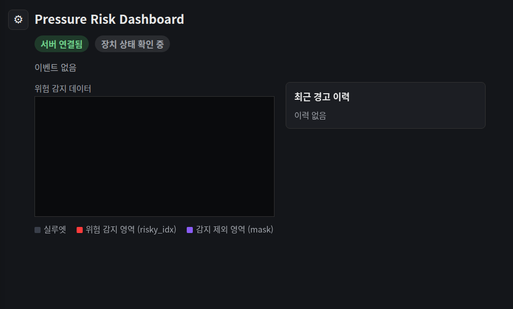
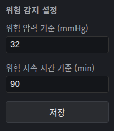
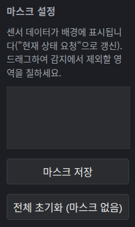
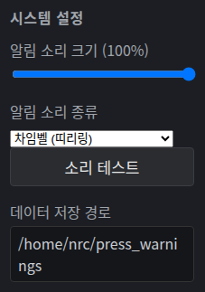

# risk_monitor

**서버(Windows)** + **클라이언트(라즈베리파이5)** 구조로 매트리스 압력 위험을 실시간 모니터링하는 앱 쌍.
서버는 대시보드를 제공하고, 클라이언트는 센서 데이터를 읽어 위험도를 계산해 서버로 보고합니다.

`server`와 `client`는 서로 짝을 이루는 앱이라 같은 디렉토리 아래 나란히 둡니다: `server/app.py`는 경고 이미지 렌더링을 위해 `client/image.py`의 `render_risk_image`를 그대로 임포트합니다.

## 목차

1. [Quick Start](#1-quick-start)
2. [데이터 저장](#2-데이터-저장)
   - [2-1. 클라이언트](#2-1-클라이언트)
   - [2-2. 서버 앱](#2-2-서버-앱)
3. [Dashboard](#3-dashboard)
4. [서버 앱 (server/)](#4-서버-앱-server)
5. [클라이언트 앱 (client/)](#5-클라이언트-앱-client)
6. [Project Structure](#6-project-structure)
7. [Tests](#7-tests)

## 1. Quick Start

### 서버 PC (Windows)

0. 설치 (빌드 + 배포)
   ```
   git clone <repo-url> pressure_recorder_repo
   cd pressure_recorder_repo\risk_monitor
   build_windows.bat
   ```
   PyInstaller로 빌드 후 `%USERPROFILE%\pressure-server`에 배포하고 방화벽 규칙을 등록합니다.
1. 서버 앱 시작
   ```
   dist\pressure-server\pressure-server.exe
   ```
   (또는 소스에서, `risk_monitor/` 안에서: `python -m server.app`)

   > exe 설치 경로에 한글이 포함되면 안 됩니다.
2. 브라우저로 대시보드 접속: `http://localhost:5000/dashboard`
3. 서버 IP 확인: 대시보드 상단에 표시되는 "서버 IP" 확인 (클라이언트 설정에 필요)

### 클라이언트 PC (라즈베리파이)

0. 설치
   ```bash
   git clone <repo-url> pressure_recorder_repo
   cd pressure_recorder_repo/risk_monitor
   python3 -m venv venv
   source venv/bin/activate
   pip install -r client/requirements.txt
   ```
1. 라즈베리파이에 SSH 접속
2. 서버 IP 설정
   ```bash
   ./set_server_ip.sh <서버-IP>
   ```
3. 클라이언트 시작
   ```bash
   ./start_client.sh
   ```
4. 클라이언트 중지
   ```bash
   ./stop_client.sh
   ```

## 2. 데이터 저장

`risk_monitor/` 폴더 자체는 소스코드만 담고, 실행 중 생성되는 데이터는 모두 폴더 밖에 저장됩니다. `start_client.sh`가 만드는 PID/로그 파일(`run/`, `logs/`)만 `risk_monitor/` 안에 남습니다 (프로세스 관리용, 데이터 아님).

### 2-1. 클라이언트

`client/warning_log.py:WarningLog`가 서버 연결 여부와 무관하게 아래를 기록합니다.

| 저장 시기 | 데이터 |
| --- | --- |
| risk 누적으로 경고가 발생한 순간 즉시 (전송 성공/실패와 무관) | `warnings.log`에 JSON 한 줄 append |
| 위험 경고 스냅샷을 서버로 전송할 때 | `images/<timestamp>.png` (전송 이미지의 로컬 사본) |
| `POST /event`, `/state`, `/image` 각 전송 시도마다 | `send.log`에 성공/실패 결과 JSON 한 줄 append (`{"kind", "ok", "message", "logged_at"}`) |

경로: `<warning-log-dir>`, 기본 `~/risk_monitor_logs/client_warnings/`. `--warning-log-dir`로 변경 가능:

```bash
python -m client.main --dry-run --server-url http://localhost:5000 \
    --warning-log-dir /var/log/pressure/client_warnings
```

### 2-2. 서버 앱

`server/warning_store.py:WarningStore`가 위험 경고를 디스크에 영구 기록합니다(메모리만 유지하는 `ServerState`와 별개 — 서버 재시작해도 기록은 남음).

| 저장 시기 | 데이터 |
| --- | --- |
| `POST /event`가 올 때마다 | `warnings.log`에 JSON 한 줄 append |
| `POST /image`가 올 때마다 | `images/<received_at>.png` |

경로: `<warning-dir>`, 기본 Windows에서 `%APPDATA%\carerobot\press_warnings`, 그 외(dev/CI)는 `~/press_warnings`. `--warning-dir`로 변경 가능:

```bash
python -m server.app --port 5000 --warning-dir /var/log/pressure/warnings
```

## 3. Dashboard

`server/app.py`가 제공하는 웹 대시보드. `GET /dashboard`를 브라우저로 열면 1.5초 간격으로 `/api/latest`를 폴링해 매트리스 그리드를 `<canvas>`에 그립니다.



- 압력이 실린 영역(`pressure_mask_idx`, 또는 `POST /state`로 받은 전체 압력값이 있으면 그레이스케일로 그 값을 그대로 사용)을 실루엣처럼 배경으로 표시
- `risky_idx`(critical_time을 넘긴 셀)를 빨간색으로 강조
- 최근 이벤트가 없으면 "정상" 상태 표시
- 위험 경고 스냅샷(`POST /image`로 받은 최신 PNG)이 있으면 그리드 아래에 표시
- 상단에 client 연결 상태 배지 표시 (연결됨 / 연결 끊김 / 확인 중)

### 설정 패널

좌상단 톱니바퀴 아이콘을 누르면 열리는 설정 패널. 여기서 바꾼 값은 `PUT /config`로 서버에 즉시 반영됩니다.

| 화면 | 내용 |
| --- | --- |
|  | **위험 감지 설정** — `critical_pressure`(위험 압력 기준, mmHg), `critical_time`(위험 지속 시간 기준, 분) |
|  | **마스크 설정** — 센서 데이터를 배경에 표시한 상태에서 드래그로 감지 제외 영역(`mask_excluded_idx`)을 칠함 |
|  | **시스템 설정** — 알림 소리 크기/종류, 위험 경고 데이터 저장 경로(`<warning-dir>`, [2-2. 서버 앱](#2-2-서버-앱) 참고) 표시 |

### 클라이언트 연결 상태

`server/connection_monitor.py:ConnectionMonitor`가 client의 접속 여부를 감시합니다. client가 서버에 실제로 요청을 보내는 엔드포인트(`GET /config`, `GET /command`, `POST /event`, `POST /state`, `POST /image`)를 마지막으로 받은 시각을 기준으로 `--client-timeout`(기본 10초) 동안 아무 요청도 없으면 연결 끊김으로 판단합니다.

- 연결 상태는 `/api/latest`의 `connected`(true/false/null)·`last_seen`으로 노출되고 대시보드 상단 배지에 실시간 반영됨
- 연결이 끊기는 순간, 그리고 다시 연결되는 순간 각각 한 번씩 `server/alert.py:fire_alert()`로 로그를 남기고, 대시보드가 열려 있으면 대시보드가 팝업 + 알림음을 띄운다 — 상태가 유지되는 동안 반복 알림은 발생하지 않음
- 서버가 처음 켜져서 client가 아직 한 번도 접속하지 않은 상태는 `connected: null`(알 수 없음)로 표시되며 알림도 발생하지 않음

```bash
python -m server.app --port 5000 --client-timeout 15
```

### 위험 경고 알림

`POST /event`로 client의 위험 경고(risky_idx가 있는 이벤트)를 받으면 `server/alert.py:fire_alert()`가 실행되어 로그를 남깁니다. 실제 사용자에게 보이는 알림음/팝업은 서버 프로세스가 아니라 대시보드(브라우저)가 담당합니다(`server/templates/dashboard.html:playAlertBeep()` / `showWarningPopup()`) — 알림 소리 크기·종류는 대시보드 설정에서 조절 가능하며 OS나 브라우저와 무관하게 항상 동일하게 재생됩니다.

## 4. 서버 앱 (server/)

`client/`가 통신하는 실제 서버. `client/mock_server`와 동일한 REST 계약을 구현하고(테스트용 mock은 그대로 `client/mock_server`에 남아있음), 위험 경고를 시각화하는 대시보드를 제공합니다.

### 엔드포인트

- `GET/PUT /config` — `calibration_factor`, `critical_pressure`, `critical_time`, `cols`, `rows`
- `POST /event` — client의 risk warning: `{"accumulated_time", "risky_idx", "pressure_mask_idx"}`
- `GET/PUT /command` — `start`/`pause`/`stop`/`reset`/`state` 명령 큐 (한 번 소비되면 비워짐)
- `POST /state` — client의 `state` 명령 응답: `{"timestamp", "pressure"}` (전체 압력 벡터)
- `POST /image` — 위험 경고 스냅샷 PNG (multipart, 필드명 `image`). 누적 이미지가 아니라 **현재 프레임 + risky_idx 셀 표시(빨간색) overlay**를 담고 있음 (client `client/image.py:render_risk_image()`가 생성)
- `GET /image/latest` — 가장 최근에 받은 위험 경고 스냅샷 PNG
- `GET /dashboard` — 대시보드 HTML
- `GET /api/latest` — 대시보드 폴링용 JSON (`risky_idx`/`pressure_mask_idx`를 `[row, col]` 2D 좌표로 변환해서 내려줌 — `server/grid.py:idx_to_rowcol()`, `row = idx // cols`). `connected`/`last_seen`으로 client 연결 상태도 포함

위험 경고 파일 저장(시기/경로/데이터)은 [2-2. 서버 앱](#2-2-서버-앱) 참고.

### 테스트

Flask 엔드포인트, `ServerState`, `ConnectionMonitor`, 그리드 좌표 변환 로직에 대한 단위 테스트.

```bash
pytest server/tests -v
```

## 5. 클라이언트 앱 (client/)

`../common/serial_reader.py` + `../common/frame_parser.py`를 재사용해 매트리스 압력 센서 프레임을 시리얼로 읽고, 셀별 누적 위험도(`accumulated_risk`)를 계산해 임계 시간을 넘긴 셀을 서버로 보고하는 헤드리스(비-GUI) 프로그램입니다.

### 동작 개요

- 매 프레임마다 `risk_mask = pressure > (critical_pressure / calibration_factor)`
- `accumulated_risk = (accumulated_risk + risk_mask * dt_min) * risk_mask` (`dt_min`은 실제 경과 시간(분), risky 하지 않은 셀은 즉시 0으로 리셋)
- `calibration_factor`, `critical_pressure`, `critical_time`은 서버에서 주기적으로 polling(`GET /config`)해 가져오며, 값이 바뀌어도 진행 중인 `accumulated_risk`는 리셋되지 않고 다음 프레임부터 새 값이 적용됨
- 어떤 셀의 `accumulated_risk`가 `critical_time`(분)에 도달하면 `POST /event`로 보고. 같은 셀이 계속 risky 상태를 유지하면 최초 알림 이후 `--alert-cooldown`(기본 5분) 간격으로만 재전송
- `/event`와 함께 `POST /image`로 위험 경고 스냅샷 PNG도 전송. **누적된 이미지가 아니라 그 순간의 현재 프레임 + risky 셀 표시(빨간색) overlay** 한 장 (`client/image.py:render_risk_image()`, multipart 필드명 `image`)

로컬 경고 기록(시기/경로/데이터)은 [2-1. 클라이언트](#2-1-클라이언트) 참고.

### 서버 명령 (start / pause / stop / reset / state)

`--command-poll-interval`(기본 2초)마다 `GET /command`로 대기 중인 명령을 가져와 즉시 반영합니다. 시리얼 수신 자체는 명령 상태와 무관하게 항상 계속되며(최신 프레임을 `state` 응답용으로 유지하기 위함), risk 누적 계산만 `pause`/`stop` 상태에서 멈춥니다.

- `start`: risk 누적 재개(정지 시간만큼 dt가 몰아서 누적되지 않도록 tick 기준 시각을 재동기화)
- `pause`, `stop`: risk 누적만 중지 (accumulated_risk는 보존됨)
- `reset`: `pause` + `accumulated_risk = 0` + `start`를 한번에 수행 — 리셋 후 즉시 다시 누적을 시작
- `state`: 현재 monitor 상태는 바꾸지 않고, 최신 pressure vector를 `POST /state`로 즉시 전송 (`{"timestamp": ..., "pressure": [...]}`)

`GET /command` 응답 형식: `{"command": "start"}` 또는 대기 중인 명령이 없으면 `{"command": null}`. 서버는 한 번 전달한 명령을 큐에서 제거해야 합니다(중복 적용 방지).

### mock_sensor — 하드웨어 없이 /dev/ttyUSB0 에뮬레이션

`client/dumpy_data/Calib31.CSV`(실제 녹화된 프레임 CSV, CsvLogger wide format)를 읽어 랜덤한 행(row=프레임)부터 순서대로 실제 센서 패킷 포맷(header+payload)으로 `socat`이 만든 가상 시리얼 장치에 스트리밍합니다. `client/main.py --port /dev/ttyUSB0` 또는 `pressure_recorder`의 GUI가 실제 하드웨어처럼 이 장치를 열어 사용할 수 있습니다.

`socat` 설치 필요 (`sudo apt install socat`). `/dev/ttyUSB0`에 심볼릭 링크를 만들려면 보통 sudo 권한이 필요합니다 — 권한 없이 테스트하려면 `--link /tmp/ttyUSB0` 같은 경로를 쓰고 client의 `--port`도 그 경로로 맞추면 됩니다.

```bash
sudo python -m client.mock_sensor --link /dev/ttyUSB0 --fps 30
# 또는 권한 없이:
python -m client.mock_sensor --link /tmp/ttyUSB0 --fps 30
```

### 개발용 실행

설치/실행 방법은 [1. Quick Start](#1-quick-start) 참고. 아래는 소스에서 직접 개발/테스트할 때 쓰는 추가 명령:

```bash
# mock 서버 (테스트용)
pip install -r client/mock_server/requirements.txt
python -m client.mock_server.server --port 5000

# 시리얼 장치 없이 합성 데이터로 테스트 (mock_sensor보다 더 간단, risk 경로 검증용)
python -m client.main --dry-run --server-url http://localhost:5000
```

### 테스트

위험도 계산(`RiskAccumulator`), 명령 처리(`monitor`), HTTP 통신, mock_sensor, 서버-클라이언트 통합(`test_integration.py`)에 대한 단위/통합 테스트.

```bash
pip install -r client/mock_server/requirements.txt  # test_integration.py에 필요
pytest client/tests -v
```

### systemd 배치 예시

`/etc/systemd/system/pressure-client.service`:

```ini
[Unit]
Description=Bliss pressure risk monitoring client
After=network-online.target

[Service]
Type=simple
User=pi
WorkingDirectory=/home/pi/pressure_recorder_repo/risk_monitor
ExecStart=/usr/bin/python3 -m client.main --port /dev/ttyUSB0 --server-url http://SERVER_HOST:5000
Restart=on-failure
RestartSec=5

[Install]
WantedBy=multi-user.target
```

## 6. Project Structure

```
risk_monitor/
├── server/                  # Flask 대시보드 + 경고 저장 (Windows)
├── client/                  # 헤드리스 모니터링 클라이언트 (라즈베리파이5)
├── server.spec              # PyInstaller spec (risk_monitor/ 에서 빌드)
├── build_windows.bat        # 서버 exe 빌드 + 배포 + 방화벽 등록
├── start_client.sh
├── stop_client.sh
└── set_server_ip.sh
```

## 7. Tests

server와 client 테스트를 한 번에 실행(각 테스트 내용은 [4. 서버 앱](#4-서버-앱-server), [5. 클라이언트 앱](#5-클라이언트-앱-client) 참고).

```bash
python -m pytest server/tests/ client/tests/ -v
```
